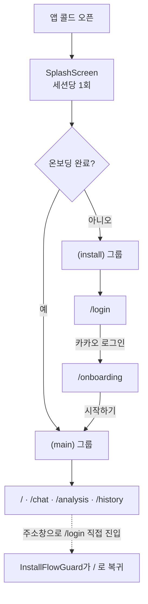

# 틈틈 (teumteum) — Frontend

> 낮에는 임상영양사가, 밤에는 틈틈이 케어합니다.

CGM(연속혈당측정기) 데이터를 기반으로 야간 혈당 관리를 돕는 **모바일 우선 PWA**입니다.
설치형 앱으로 동작하는 것을 전제로 만들어졌고, 데스크톱에서는 태블릿 비율의 중앙 컬럼으로 표시됩니다.

---

## 목차

1. [기술 스택](#기술-스택)
2. [빠른 시작](#빠른-시작)
3. [스크립트](#스크립트)
4. [폴더 구조](#폴더-구조)
5. [아키텍처 규칙](#아키텍처-규칙)
6. [라우팅과 화면 흐름](#라우팅과-화면-흐름)
7. [스타일 작성 규칙](#스타일-작성-규칙)
8. [API 모킹 (MSW)](#api-모킹-msw)
9. [PWA와 서비스 워커](#pwa와-서비스-워커)
10. [기여 가이드](#기여-가이드)
11. [트러블슈팅](#트러블슈팅)

---

## 기술 스택

| 영역          | 사용 기술                                          |
| ------------- | -------------------------------------------------- |
| 프레임워크    | Next.js 16 (App Router, Turbopack, React Compiler) |
| 언어          | TypeScript 5                                       |
| UI            | React 19                                           |
| 스타일        | 순수 CSS — 전역 디자인 시스템 + CSS Modules        |
| API 모킹      | MSW 2 (브라우저 + Node 양쪽)                       |
| 패키지 매니저 | pnpm 10.15.0                                       |
| 린트·포맷     | ESLint 9 (`eslint-config-next`) + Prettier 3       |

---

## 빠른 시작

### 1. 사전 요구사항

- **Node.js 20.9 이상** (22 LTS 이상 권장)
- **pnpm 10.15.0** — `package.json`의 `packageManager` 필드로 고정되어 있습니다

pnpm이 없다면 corepack으로 설치하세요. 버전이 자동으로 맞춰집니다.

```bash
corepack enable
corepack prepare pnpm@10.15.0 --activate
```

### 2. 클론 및 설치

```bash
git clone https://github.com/likelion-hackathon-team1/teumteum-fe.git
cd teumteum-fe
pnpm install
```

### 3. 환경 변수

환경 변수는 두 파일로 나뉩니다.

| 파일               | 저장소 포함  | 용도                                                                    |
| ------------------ | ------------ | ----------------------------------------------------------------------- |
| `.env.development` | ✅ 커밋됨    | `NEXT_PUBLIC_API_MOCKING=enabled` — 팀 공통 설정이라 그대로 두면 됩니다 |
| `.env.local`       | ❌ gitignore | 개인 비밀값. **직접 만들어야 합니다**                                   |

`.env.local`을 프로젝트 루트에 만들고 아래를 채우세요.

```bash
# 웹 푸시 구독에 사용하는 VAPID 공개키
NEXT_PUBLIC_VAPID_PUBLIC_KEY=
```

값은 팀에 요청하거나, 아래 명령으로 직접 생성한 뒤 **Public Key** 쪽을 넣으면 됩니다.

```bash
pnpm dlx web-push generate-vapid-keys
```

> 이 값이 없어도 앱은 정상적으로 실행됩니다. 홈 화면의 **알림 받기** 버튼을 눌렀을 때만 실패합니다.

### 4. 실행

```bash
pnpm dev
```

`http://localhost:3000` 에서 확인합니다. 모바일 화면이 기본이므로 **DevTools의 디바이스 모드(iPhone 등)로 보는 것을 권장**합니다.

첫 실행 시에는 설치 플로우를 타게 됩니다: **스플래시 → `/login` → `/onboarding` → `/`**

---

## 스크립트

| 명령                     | 설명                          |
| ------------------------ | ----------------------------- |
| `pnpm dev`               | 개발 서버 (Turbopack)         |
| `pnpm build`             | 프로덕션 빌드 + 타입 검사     |
| `pnpm start`             | 빌드 결과 실행                |
| `pnpm lint`              | ESLint 검사                   |
| `pnpm format`            | Prettier로 전체 포맷          |
| `pnpm format:check`      | 포맷 위반만 검사 (수정 안 함) |
| `pnpm exec tsc --noEmit` | 타입만 단독 검사              |

> 아직 테스트 러너는 도입하지 않았습니다. 현재 검증 수단은 **타입 검사 · 린트 · 빌드 · 수동 확인** 네 가지입니다.

---

## 폴더 구조

```
src/
├── app/                              Next.js 라우팅. page.tsx는 조립만 하는 얇은 파일
│   ├── layout.tsx                    루트 레이아웃 — .tt-app 프레임 + Providers + Splash
│   ├── globals.css                   디자인 시스템 진입점
│   ├── manifest.ts                   PWA 매니페스트 (Next 파일 규약, 이 위치 고정)
│   ├── icon.png                      파비콘 (Next 파일 규약, 이 위치 고정)
│   │
│   ├── _providers/                   UI 없음. 앱 시동·전역 부수효과
│   │   ├── AppProviders.tsx          루트 레이아웃은 이것 하나만 import
│   │   ├── MSWProvider.tsx           목 워커 준비될 때까지 children 보류
│   │   └── ServiceWorkerRegister.tsx
│   │
│   ├── _components/                  루트 레이아웃 전용 UI
│   │   └── SplashScreen/
│   │
│   ├── (main)/                       하단 네비게이션이 있는 본 서비스
│   │   ├── layout.tsx                OnboardingGuard + 스크롤 영역 + BottomNav
│   │   ├── page.tsx                        →  /
│   │   ├── chat/ analysis/ history/        →  /chat  /analysis  /history
│   │   └── _components/              이 그룹 전용 UI
│   │       ├── AppHeader/
│   │       ├── BottomNav/
│   │       └── PageHeader/
│   │
│   └── (install)/                    최초 설치 플로우. 네비게이션 없음
│       ├── layout.tsx                InstallFlowGuard + 스크롤 영역
│       ├── login/                          →  /login
│       └── onboarding/                     →  /onboarding
│
├── features/                         도메인 단위. UI·로직·스타일을 한 폴더에
│   ├── auth/                         session.ts, OnboardingGuard, InstallFlowGuard
│   └── notification/                 PushNotificationManager
│
├── shared/                           도메인을 모르는 재사용 코드
│   ├── ui/                           Button/, Card/
│   ├── lib/                          storage.ts (SSR·차단 환경 안전 스토리지)
│   └── styles/                       전역 디자인 시스템 CSS 11개
│
├── mocks/                            MSW 설정 (앱 코드 아님)
└── instrumentation.ts                서버 사이드 MSW 부팅 (Next 규약, 이 위치 고정)
```

**최상위는 `app` / `features` / `shared` / `mocks` 네 개뿐입니다.**

`_` 로 시작하는 폴더는 Next.js가 라우팅에서 완전히 제외합니다. `(main)` `(install)` 같은 괄호 폴더는 **라우트 그룹**이라 URL에 나타나지 않습니다 — `(main)/chat/page.tsx`의 주소는 그냥 `/chat`입니다.

---

## 아키텍처 규칙

새 파일을 어디에 둘지는 아래 두 단계로 결정합니다.

```
1. 도메인(auth, notification, chat …)을 아는가?
        │
        ├─ 예 ──▶  features/<도메인>/
        │
        └─ 아니오
                │
                2. app/ 안의 한 곳에서만 쓰는가?
                        │
                        ├─ 예 ──▶  그 소비자 옆 _components/ 또는 _providers/
                        │
                        └─ 아니오 ──▶  shared/
```

**1번이 2번보다 우선합니다.** 소비자가 한 곳뿐이어도 도메인을 알면 `features/`로 갑니다.
예를 들어 `PushNotificationManager`는 홈 화면에서만 쓰이지만 알림 도메인을 알기 때문에 `features/notification/`에 있습니다.

### 컴포넌트 = 폴더 규칙

**파일이 2개가 되는 순간(`.module.css`·테스트·훅이 붙는 순간) 폴더로 승격합니다.** 단일 `.tsx`면 평평하게 둡니다.

```
✅  _components/BottomNav/BottomNav.tsx + BottomNav.module.css
✅  features/notification/PushNotificationManager.tsx        (CSS 없음 → 평평하게)
❌  _components/BottomNav.tsx + _components/BottomNav.module.css
```

폴더 목록에 `.module.css`가 늘어서지 않도록 하기 위한 규칙입니다.

### UI vs 부수효과

`_providers/`와 `_components/`를 나누는 기준은 **화면을 그리는가**입니다.

- `_providers/` — `null`을 렌더하거나 children만 통과시키는 것 (SW 등록, MSW 부팅)
- `_components/` — 실제로 화면을 그리는 것 (스플래시, 네비게이션, 헤더)

---

## 라우팅과 화면 흐름

인증·온보딩 상태에 따라 사용자는 항상 **두 그룹 중 하나에만** 머뭅니다.



|                 | `(main)/layout.tsx`                | `(install)/layout.tsx` |
| --------------- | ---------------------------------- | ---------------------- |
| 적용 경로       | `/` `/chat` `/analysis` `/history` | `/login` `/onboarding` |
| 가드            | 온보딩 **미완료** → `/login`       | 온보딩 **완료** → `/`  |
| 하단 네비게이션 | 있음                               | 없음                   |

두 가드가 정확히 반대 조건이라 상태가 어긋날 수 없습니다.

### 상태 저장 방식

| 키                | 저장소         | 의미                                    |
| ----------------- | -------------- | --------------------------------------- |
| `tt-auth`         | localStorage   | 로그인 여부 (현재는 **임시 목 로그인**) |
| `tt-onboarded`    | localStorage   | 온보딩 완료 여부                        |
| `tt-splash-shown` | sessionStorage | 이번 세션에 스플래시를 이미 보여줬는지  |

스플래시가 `sessionStorage`인 이유는 **새로고침에서는 안 뜨고 앱을 새로 열었을 때만** 떠야 하기 때문입니다.

> ⚠️ 카카오 로그인은 아직 실제 OAuth가 아닙니다. `features/auth/session.ts`가 localStorage에 플래그만 세우는 임시 구현입니다.

---

## 스타일 작성 규칙

CSS는 세 갈래로 나뉩니다. **새 스타일을 어디에 쓸지 판단할 때 이 표를 보세요.**

| 종류                    | 위치                                 | 예시                                                        |
| ----------------------- | ------------------------------------ | ----------------------------------------------------------- |
| 전역으로 영구히 남는 것 | `shared/styles/`                     | 색·간격 토큰, 리셋, 타이포그래피, 애니메이션, 레이아웃 유틸 |
| 재사용 UI 컴포넌트      | `shared/ui/<Name>/<Name>.module.css` | `Button`, `Card`                                            |
| 특정 화면 전용          | 그 화면 폴더의 `.module.css`         | `login/page.module.css`                                     |

- 전역 클래스는 `tt-` 접두사를 씁니다. **CSS Module 안에서는 접두사를 붙이지 않습니다** (이미 스코프가 격리되므로).
- 라우트 폴더의 CSS Module 파일명은 `page.module.css`로 통일합니다.
- `shared/styles/primitives.css`에는 **아직 쓰는 화면이 없어 대기 중인** 클래스들(칩·뱃지·태그·인풋 등)이 남아 있습니다. 실제로 사용하게 되는 시점에 `shared/ui/`의 컴포넌트로 옮기고 전역 클래스는 지웁니다.

---

## API 모킹 (MSW)

백엔드가 완성되기 전까지 모든 API는 MSW로 모킹합니다. 브라우저와 서버 양쪽에서 동일한 핸들러가 동작합니다.

```
src/mocks/
├── handlers.ts             ← 핸들러를 여기에 추가합니다
├── browser.ts              setupWorker  (클라이언트)
├── node.ts                 setupServer  (서버 · instrumentation.ts가 사용)
└── service-worker-url.ts   SW URL 생성 (모킹 on/off에 따라 쿼리 부착)
```

### 핸들러 추가하기

```ts
// src/mocks/handlers.ts
import { http, HttpResponse } from 'msw';

export const handlers = [
  http.get('*/api/example', () => {
    return HttpResponse.json({ ok: true, source: 'msw' });
  }),
];
```

> **경로 앞의 `*`는 필수입니다.**
> 서버 사이드 fetch는 절대 URL(`http://localhost:3000/api/...`)로 나가고 클라이언트는 상대 경로로 나갑니다.
> `'/api/example'`로 쓰면 서버 쪽 요청이 매칭되지 않아 Next의 라우터까지 흘러가 404가 납니다.

### 켜고 끄기

`.env.development`의 `NEXT_PUBLIC_API_MOCKING=enabled` 로 제어합니다. `enabled`가 아니면 워커도, 서버 인터셉터도, SW의 목 스크립트도 전부 로드되지 않습니다.

### ⚠️ 알려진 제약

`handlers.ts`를 수정하면 **Node 쪽 인터셉터는 HMR로 갱신되지 않습니다.** 서버 사이드 응답이 예전 그대로라면 개발 서버를 껐다 켜세요. (Turbopack HMR과 모듈 스코프 `setupServer` 싱글턴의 조합에서 오는 구조적 제약입니다.)

---

## PWA와 서비스 워커

**서비스 워커는 `public/service-worker.js` 하나뿐입니다.** 스코프 충돌을 피하려고 MSW 워커를 이 파일 안으로 합쳐 넣었습니다.

```js
// public/service-worker.js
if (swUrl.searchParams.get('enableApiMocking') === 'true') {
  self.registration.unregister = () => Promise.resolve(false); // ← 아래 설명 참고
  importScripts('/mockServiceWorker.js');
}
// ... push / notificationclick 핸들러
```

`unregister`를 무력화하는 이유는, `mockServiceWorker.js`가 **클라이언트가 모두 닫히면 스스로 등록을 해제**하기 때문입니다. 그대로 두면 새로고침할 때마다 푸시 구독까지 함께 날아갑니다.

- `public/mockServiceWorker.js`는 MSW가 생성한 파일이며 **저장소에 커밋되어 있습니다.** 직접 수정하지 마세요. msw를 업그레이드했다면 `pnpm dlx msw init public --save`로 재생성합니다.
- `next.config.ts`에서 `/service-worker.js`에 `no-store` 캐시 헤더를 걸어 항상 최신 워커를 받도록 했습니다.

> 📌 TODO: `notificationclick` 핸들러의 `clients.openWindow('<https://your-website.com>')`가 아직 플레이스홀더입니다.

---

## 기여 가이드

### 브랜치 전략

`main`에 직접 푸시하지 않습니다. 항상 브랜치를 파고 **Pull Request**로 병합합니다.

```bash
git checkout main
git pull origin main
git checkout -b feat/onboarding-steps
```

브랜치 이름은 `<타입>/<간단한-요약>` 형식입니다.

```
feat/onboarding-steps
fix/push-subscription-lost
refactor/folder-structure
```

### 커밋 메시지

**접두사는 영어, 내용은 한국어**로 씁니다.

```
feat: 온보딩 2~4단계 선택 화면 추가
fix: 스토리지 차단 환경 크래시 제거
refactor: Button·Card를 shared/ui 컴포넌트로 추출
chore: eslint 설정 정리
```

| 접두사     | 사용 시점                        |
| ---------- | -------------------------------- |
| `feat`     | 사용자에게 보이는 기능 추가·변경 |
| `fix`      | 버그 수정                        |
| `refactor` | 동작 변화 없는 구조 개선         |
| `chore`    | 설정·의존성·빌드 등 부수 작업    |
| `docs`     | 문서 수정                        |

한 커밋에는 **하나의 작업 단위**만 담습니다. 파일 이동과 로직 변경은 분리하는 편이 리뷰하기 좋습니다.

### PR 올리기 전 체크리스트

아래 세 가지는 **반드시 통과**해야 합니다.

```bash
pnpm exec tsc --noEmit   # 1. 타입 검사
pnpm lint                # 2. 린트
pnpm build               # 3. 빌드
```

여기에 더해, 바꾼 화면은 **브라우저에서 직접 확인**하세요. 특히 아래 항목은 자동 검사로 잡히지 않습니다.

- [ ] 모바일 폭(390px)과 데스크톱 폭(1400px) 양쪽에서 레이아웃이 깨지지 않는가
- [ ] 라우팅을 건드렸다면 신규 사용자 전체 플로우가 동작하는가
- [ ] 콘솔에 에러나 경고가 새로 생기지 않았는가

### 상태 초기화 스니펫

설치 플로우나 스플래시를 다시 보려면 브라우저 콘솔에 붙여넣으세요.

```js
// 최초 설치 직후 상태로 되돌리기
localStorage.clear();
sessionStorage.clear();
location.href = '/';
```

```js
// 스플래시만 다시 보기
sessionStorage.clear();
location.reload();
```

### 코드 스타일

Prettier가 포맷을 강제하고, ESLint는 `eslint-config-prettier`로 포맷 관련 규칙을 끕니다. **둘이 충돌하지 않으니 포맷은 Prettier에만 맡기세요.**

```json
{
  "semi": true,
  "singleQuote": true,
  "trailingComma": "all",
  "printWidth": 100,
  "tabWidth": 2,
  "arrowParens": "avoid"
}
```

에디터에 **저장 시 자동 포맷**을 켜두는 것을 권장합니다. VS Code라면 Prettier 확장을 설치하고 `.vscode/settings.json`에:

```json
{
  "editor.formatOnSave": true,
  "editor.defaultFormatter": "esbenp.prettier-vscode"
}
```

몇 가지 프로젝트 관례입니다.

- 컴포넌트는 **named export**를 씁니다. `page.tsx`·`layout.tsx`만 Next 규약상 default export입니다.
- 내부 모듈은 `@/` 별칭(= `src/`)으로 참조합니다. 단 **같은 폴더나 바로 아래 폴더는 상대 경로**를 씁니다.
- 설명용 주석은 남기지 않습니다. 이름과 구조로 설명하고, 정말 비자명한 제약만 한 줄로 적습니다.

---

## 트러블슈팅

| 증상                                          | 원인과 해결                                                                 |
| --------------------------------------------- | --------------------------------------------------------------------------- |
| 라우트를 옮겼는데 `tsc`가 없는 모듈을 찾는다  | `.next`에 남은 생성 타입 때문입니다. `rm -rf .next` 후 다시 빌드하세요      |
| `handlers.ts`를 고쳤는데 서버 응답이 그대로다 | Node 쪽 MSW는 HMR로 갱신되지 않습니다. 개발 서버를 재시작하세요             |
| 스플래시가 안 뜬다                            | 정상입니다. 세션당 1회만 뜹니다. `sessionStorage.clear()` 후 새로고침하세요 |
| 로그인·온보딩 화면을 다시 못 본다             | `localStorage.clear()` 후 `/`로 이동하세요                                  |
| 알림 구독이 새로고침마다 풀린다               | `public/service-worker.js`의 `unregister` 무력화가 빠졌는지 확인하세요      |
| 콘솔에 `data-*` 하이드레이션 불일치 경고      | 브라우저 확장 프로그램이 DOM을 건드려서 생깁니다. 앱 문제가 아닙니다        |
| 데스크톱에서 양옆이 검게 보인다               | 의도된 디자인입니다. 태블릿 비율 중앙 컬럼 + 어두운 배경입니다              |
